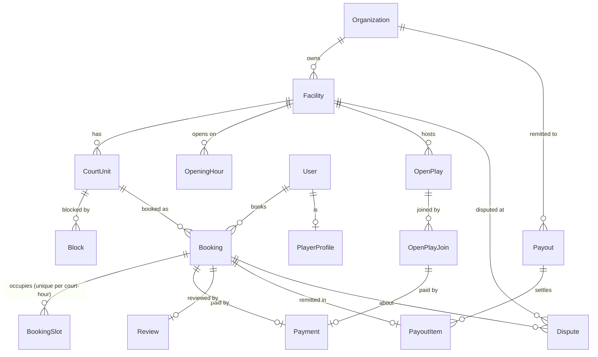

# Courtix — Database Schema

**MySQL + Prisma.** 40 tables covering every function the app has today across
the three roles — player, owner, and platform admin.

- Schema: [`prisma/schema.prisma`](prisma/schema.prisma)
- Seed: [`prisma/seed.ts`](prisma/seed.ts)
- Connection: `DATABASE_URL` in `.env` → `mysql://…/courtix`
- Status: **created, live, and seeded** — all 40 tables exist and the catalog is
  loaded (4 sports, 4 cities, 36 amenities, 14 host orgs, 14 facilities with 59
  court units, 8 open plays, 1 demo player).

```bash
npm run db:studio        # browse the data in a GUI
npm run db:push          # re-sync after editing the schema
npm run db:seed          # load the catalog (idempotent — safe to re-run)
npx prisma generate      # regenerate the typed client
```

---

## Conventions

| Rule | Why |
|---|---|
| Money is integer **centavos** (`…Cents`) | Floats lose ₱0.01 in payouts. `35000` = ₱350.00 |
| Rates are **basis points** (`…Bps`) | `600` = 6.00%, no rounding drift |
| Times of day are integer **24h hours** | Matches the app's slot model (`startHour`, `hours`) |
| Dates are `@db.Date` | A booking day has no timezone |
| Long text is `@db.Text` | MySQL's default `VARCHAR(191)` would truncate descriptions/messages |

---

## The tables, by domain

### Identity & auth (7)
`user` · `account` · `session` · `verificationtoken` · `playerprofile` · `organization` · `organizationmember`

NextAuth-compatible. `user.role` is `PLAYER | OWNER | ADMIN | SUPER_ADMIN`. A
`PlayerProfile` holds the DUPR rating and skill; an `Organization` is the host
business, and `OrganizationMember` links owners/staff to it.

### Catalog (3)
`sport` · `city` · `amenity`

Reference data. `city.status` (`LIVE | WAITLIST`) and `waitlistRank` drive the
city-rollout order the admin controls.

### Facilities & courts (7)
`facility` · `courtunit` · `facilityimage` · `facilitysport` · `facilityamenity` · `openinghour` · `block`

A **facility** (e.g. Kitchen Line Club) has many **court units** (Court 1,
Court 2 …). This is the multi-court model — each `CourtUnit` books independently.
`Block` takes one court off the market for maintenance/leagues.

### Bookings (2)
`booking` · `bookingslot`

`Booking` snapshots the price at time of booking and records **which court**
(`courtUnitId`). `BookingSlot` is the double-booking guard — see below.

### Open plays (2)
`openplay` · `openplayjoin`

Drop-in sessions with a seat capacity. `@@unique([openPlayId, playerEmail])`
stops anyone joining the same session twice; a full session routes to a
`WAITLISTED` join.

### Payments, refunds, payouts (6)
`payment` · `refund` · `payout` · `payoutitem` · `facilitytransaction` · `membership`

A `Payment` belongs to exactly one booking **or** one open-play join.
`providerIntentId` is unique — the idempotency key for PayMongo webhooks.
`Payout` remits to an owner org twice a month; `PayoutItem` links the bookings
in that run.

### Community (4)
`review` · `savedcourt` · `conversation` · `message`

Reviews (one per completed booking), player favourites, and the player↔host
messaging the owner dashboard references.

### Disputes & support (2)
`dispute` · `disputemessage`

`Dispute.slaDueAt` powers the admin "over SLA" flag; `type` covers refunds,
no-shows, damage, and double-booking claims.

### Launch waitlist (1)
`waitlistentry` + `waitlistsport`

The CTA form's storage. `position` is the queue number handed back; `cityText`
is what the visitor typed, optionally linked to a catalog `city`.

### Platform (4)
`platformsetting` · `notification` · `notificationpreference` · `auditlog`

`PlatformSetting` is a single row holding commission/fee/policy values the admin
edits. `AuditLog` trails privileged actions (approvals, refunds, rate changes).

### Join tables (2)
`playersport` · `waitlistsport` — m:n sport interest.

---

## The one constraint that matters: no double-booking

`BookingSlot` holds **one row per occupied court-hour**, with:

```prisma
@@unique([courtUnitId, date, hour])
```

Confirmed live in MySQL as `BookingSlot_courtUnitId_date_hour_key` (unique).

Booking a 2-hour slot on Court 1 inserts 2 rows. A second booking that overlaps
**any** of those hours on the same court fails the unique constraint — the
database rejects it, no matter what the application logic did. Cancelling a
booking deletes its slot rows, so the constraint always reflects live occupancy.

This is why MySQL is fine here despite not having Postgres exclusion
constraints: the guarantee lives in a plain unique index. The API catches the
constraint violation and returns the `409` the checkout UI already handles.

---

## Function → table map

### Player / user
| Function (in the app) | Tables |
|---|---|
| Sign in / account | `user`, `account`, `session` |
| Player profile, rating, favourite sports | `playerprofile`, `playersport` |
| Browse & book a court, pick Court 1/2 | `facility`, `courtunit`, `booking`, `bookingslot` |
| Booking confirmation + reference | `booking` (`ref`, `unitLabel` via `courtUnit`) |
| Pay for a booking | `payment`, `refund` |
| Join / waitlist an open play | `openplay`, `openplayjoin`, `payment` |
| `/player-home` upcoming bookings | `booking` filtered by `playerId` |
| Saved / suggested courts | `savedcourt`, `facility` |
| Review a court | `review` |
| Message a host | `conversation`, `message` |
| Join the launch waitlist | `waitlistentry`, `waitlistsport` |
| Notifications | `notification`, `notificationpreference` |

### Owner
| Function | Tables |
|---|---|
| Own multiple facilities & courts | `organization`, `facility`, `courtunit` |
| Photos, amenities, hours | `facilityimage`, `facilityamenity`, `openinghour` |
| Per-court booking view ("Court 1 / Court 2") | `booking` + `courtunit` |
| Block hours / maintenance | `block` |
| List & manage open plays | `openplay`, `openplayjoin` |
| Players who booked | `booking`, `membership` |
| Payouts (twice monthly) | `payout`, `payoutitem` |
| Revenue / transactions | `facilitytransaction`, `payment` |
| Reports & utilisation | `booking`, `bookingslot` (aggregates) |
| Notification & booking-rule settings | `notificationpreference`, `openinghour` |

### Super admin
| Function | Tables |
|---|---|
| Platform overview / KPIs | aggregates over `booking`, `payment`, `facility`, `user` |
| Facilities directory & coverage | `facility`, `courtunit`, `city` |
| Users management | `user`, `playerprofile`, `organizationmember` |
| Facility approvals | `facility.status` (`PENDING_REVIEW`), `auditlog` |
| Live waitlist demand | `waitlistentry`, `waitlistsport`, `city` |
| Commission & payouts | `payout`, `payoutitem`, `organization.commissionBps` |
| Disputes with SLA | `dispute`, `disputemessage` |
| City rollout | `city` (`status`, `waitlistRank`) |
| Platform settings (rates, policy) | `platformsetting` |
| Audit trail | `auditlog` |

---

## Core relationships (booking flow)



---

## The seed

`prisma/seed.ts` imports `src/lib/data/*` directly rather than restating the
catalog, so the database can never drift from what the pages render. Run it with
`npm run db:seed`.

| Loaded from | Into |
|---|---|
| `SPORTS` | `sport` (pesos → `fromPriceCents`) |
| `COURTS[].loc` | `city` — all `LIVE`, since a facility already lists there |
| `COURTS[].amenities` | `amenity` (id = slug of the label) |
| `COURTS[].host` | `organization` (`commissionBps` null → platform default) |
| `COURTS` | `facility` + `facilityimage` + `facilityamenity` + `facilitysport` |
| `COURTS[].units` | `courtunit` — "Court 1"…"Court N", "Bay 1"…"Bay 20" |
| `allOpenPlays()` | `openplay` + `openplayjoin` (`seededJoined` becomes real rows) |
| `getCurrentPlayer()` | `user` + `playerprofile` + `playersport` + `savedcourt` |
| — | `platformsetting` singleton at schema defaults |

Every write is an upsert on a natural unique, so re-running changes nothing.
Two properties worth keeping if you extend it:

- **It never deletes.** A facility that sheds court units gets the extras marked
  `active: false`, because past bookings still point at those rows.
- **It never clobbers admin edits.** `platformsetting` is `update: {}` — a
  re-seed won't reset a commission rate someone changed in the dashboard.

It does **not** seed bookings, payments, payouts, reviews or disputes. Those are
transactional records; inventing them would put fake money in the owner and
admin dashboards.

Placeholder host and open-play-seat emails use the reserved `.invalid` TLD
(`tee-line-golf@seed.courtix.invalid`) so no seed row can reach a real person
once notifications land.

---

## Adopting it in the app

The app currently persists to `data/*.json` behind the `Storage` interface in
[`src/lib/server/storage.ts`](src/lib/server/storage.ts). To switch to this
database, implement that same interface against Prisma and return it from
`getStorage()` when `STORAGE_DRIVER=mysql` — no page, component, or route
changes. See [`BOOKING_INTEGRATION_PLAN.md`](BOOKING_INTEGRATION_PLAN.md) § 9.

Sketch:

```ts
// src/lib/server/storage.prisma.ts
import { PrismaClient } from "@prisma/client";
const db = new PrismaClient();

export const prismaStorage: Storage = {
  async addBooking(b) {
    // One transaction: insert booking + its per-hour slot rows. If any slot
    // row collides with the unique index, the whole thing rolls back → 409.
    return db.$transaction(async (tx) => {
      const booking = await tx.booking.create({ data: { /* … */ } });
      await tx.bookingSlot.createMany({
        data: hoursOf(b).map((hour) => ({
          bookingId: booking.id, courtUnitId: b.courtUnitId, date: b.date, hour,
        })),
      });
      return booking;
    });
  },
  // …the rest of the interface
};
```

**Next steps toward production** (from the integration plan): implement
`prismaStorage` against the `Storage` interface, add slot-hold expiry, wire
PayMongo into `payment`, and put auth in front of the owner/admin routes.
